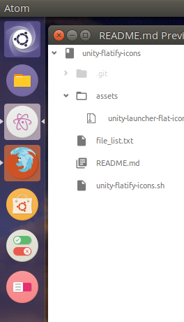

# unity-flatify-icons
> Shell script to flatten Ubuntu Unity's launcher icons.

## Screenshot


## Instructions
The following terminal commands will enable you to run the script. Please inspect the source code first if you don't trust me.
```bash
git clone https://github.com/mjsolidarios/unity-flatify-icons.git

cd unity-flatify-icons

sh unity-flatify-icons.sh

```
You have to run these commands again if Ubuntu updates your Unity launcher icons.
